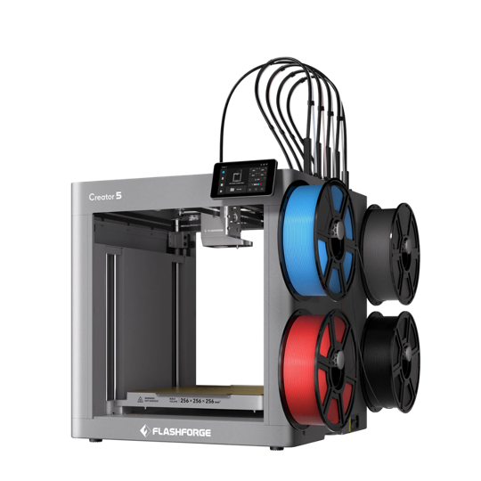
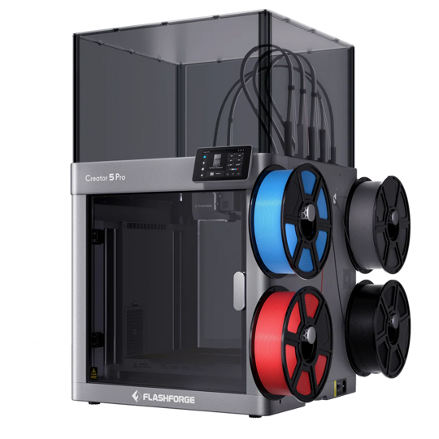
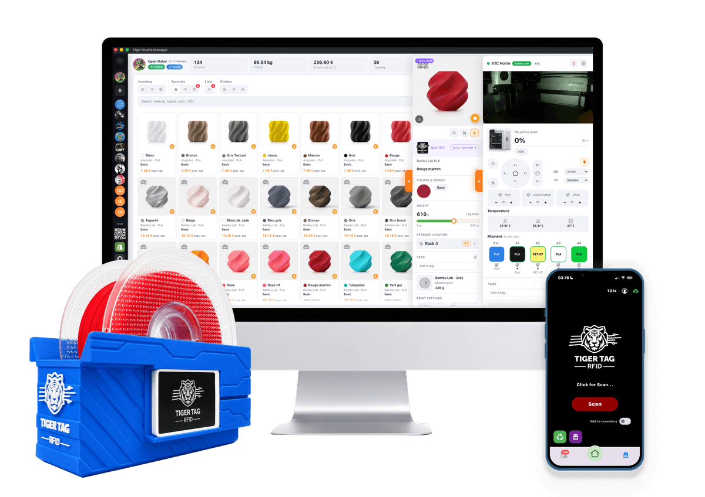

  <picture>
    <source media="(prefers-color-scheme: dark)" srcset="assets/flashforge-mark-dark.svg">
    
  </picture>
  &nbsp;&nbsp;&nbsp;
  
  &nbsp;&nbsp;&nbsp;
  

<h1 align="center">FlashForge × TigerSystem</h1>

  <strong>Official Creator 5 / Creator 5 Pro firmware — FlashForge Cloud and LAN, at the same time.</strong> 
  Built by FlashForge, together with TigerTag.

  
  
  
  

<table>
  <tr>
    <td align="center" width="50%">
       
      <strong>FlashForge Creator 5</strong> 
      <code>Creator5-&lt;version&gt;.tgz</code>  
      
    </td>
    <td align="center" width="50%">
       
      <strong>FlashForge Creator 5 Pro</strong> 
      <code>Creator5Pro-&lt;version&gt;.tgz</code>  
      
    </td>
  </tr>
</table>

Always the latest version, for your model — in one click.

  <a href="../../releases/latest"><strong>All releases</strong></a>
  &nbsp;·&nbsp;
  <a href="#install">Install</a>
  &nbsp;·&nbsp;
  <a href="#what-it-changes">What it changes</a>
  &nbsp;·&nbsp;
  <a href="#what-is-tigersystem">TigerSystem</a>
  &nbsp;·&nbsp;
  <a href="#staying-up-to-date">Staying up to date</a>

---

## Thank you, FlashForge

This firmware exists because **FlashForge** said yes.

It was developed by FlashForge's own engineering team, at TigerTag's request and in close
collaboration with us, so that their printers could join the TigerTag ecosystem without giving
anything up. It is an **official FlashForge firmware** — not a community fork, not a patch — and it
is published here with their agreement.

We are grateful to the FlashForge team for their openness, their time and their trust. Opening a
printer to an ecosystem that is not your own is a rare decision, and every maker who owns one
benefits from it.

---

## What it changes

|  | Stock firmware | **FlashForge × TigerSystem** |
|---|:---:|:---:|
| FlashForge Cloud (app, remote access) | ✅ | ✅ |
| LAN access (local tools on your network) | ✅ | ✅ |
| **Both at the same time** | ❌ | ✅ |
| Tiger Studio Manager, Tiger NFC Connect and TigerSpool with Cloud on | ❌ | ✅ |

Out of the box, a Creator 5 makes you choose between **Cloud** and **LAN**. With this firmware you
keep FlashForge Cloud, and the TigerTag apps and devices reach the printer on your network at the
same time — on the desktop, on your phone, and at the printer's side.

### RFID on a printer that has no reader

The Creator 5 and Creator 5 Pro ship without an RFID reader. Through the
**[TigerSystem](https://tigersystem.io)**, they now read one:

- **[Tiger Studio Manager](https://github.com/TigerTag-Project/TigerTag-Studio-Manager)** — the
  desktop app — follows the printer live and knows what is loaded in each slot.
- **[Tiger NFC Connect](https://github.com/TigerTag-Project/TigerSystem-Docs/blob/main/docs/products/tigertag-connect.md)**
  — the iOS and Android app — reads a spool's chip with your phone and reaches the printer on the
  same network.
- **[TigerSpool](https://github.com/TigerTag-Project/TigerSpool-RFID)** — a small reader box beside
  the printer — reads a spool's chip and writes the filament into the slot you pick: material,
  brand, colour and temperatures.

A FlashForge printer can now read the chip of **any filament brand that uses TigerTag** — and of the
spools **makers tag themselves at home**, on filament that never shipped with a chip.

> [!NOTE]
> The firmware is designed to connect the printer to the TigerTag ecosystem, but it is **free for
> anyone to use**, with or without TigerTag hardware.

---

## What is TigerSystem?

  

A filament spool is the most-handled object in 3D printing — and the least intelligent. Printer
makers have started fixing that with RFID tags, **but each one only inside its own walls**: one
brand's tag means nothing to another brand's printer, and the data belongs to the manufacturer, not
to the person who bought the filament.

**TigerSystem** is the open answer, built around one idea:

> **The spool's identity belongs to its owner — not to a printer brand.**

Every spool carries a **[TigerTag](https://github.com/TigerTag-Project/TigerSystem-Docs/blob/main/docs/products/tigertag.md)** NFC chip holding its full profile —
brand, material, colour, diameter, print settings — in an **open, documented format** that any NFC
device can read: a phone, a desktop reader, a printer. The ambition is to become to 3D-printing
materials what the barcode became to the shelf.

### Our fight

It started in 2023, right after Formnext, when printer makers began locking spool tags into
proprietary formats one after another. We refused to let the industry settle there. A format had to
exist that is **open source, neutral, cross-platform and centred on the user** — not as a manifesto,
but as a working alternative that does *more* than the closed ones, for every filament brand, at no
extra cost to the maker buying the spool.

That is why this firmware matters. When a printer maker like **FlashForge** opens its machine to an
open ecosystem it does not own, every user wins — and the case for open spool identity gets
stronger. **Read the full story:** [Why TigerSystem exists](https://github.com/TigerTag-Project/TigerSystem-Docs/blob/main/docs/vision/why-tigersystem.md) ·
[An open ecosystem](https://github.com/TigerTag-Project/TigerSystem-Docs/blob/main/docs/philosophy/open-ecosystem.md).

### The ecosystem — everything is open

| | Project | What it is |
|---|---|---|
| 📚 | **[TigerSystem-Docs](https://github.com/TigerTag-Project/TigerSystem-Docs)** | The source of truth — concepts, products, compatibility, for humans and AI |
| 🏷️ | **[TigerTag-RFID-Guide](https://github.com/TigerTag-Project/TigerTag-RFID-Guide)** | The open TigerTag chip protocol — full spec and public registry |
| 🖥️ | **[Tiger Studio Manager](https://github.com/TigerTag-Project/TigerTag-Studio-Manager)** | Desktop app — inventory, racks, live printers across six brands |
| 📱 | **[Tiger NFC Connect](https://github.com/TigerTag-Project/TigerSystem-Docs/blob/main/docs/products/tigertag-connect.md)** | iOS / Android app — tap to read, tap to write, browse the catalogue |
| 🧵 | **[TigerSpool RFID](https://github.com/TigerTag-Project/TigerSpool-RFID)** | Reader box beside the printer — scan a spool, it lands in the right slot |
| ⚖️ | **[TigerScale V3](https://github.com/TigerTag-Project/Tiger-Scale-V3)** | Connected filament scale — dual NFC readers, touchscreen, battery |
| 📡 | **[TigerPOD](https://github.com/TigerTag-Project/TigerPOD)** | Open-source desktop NFC reader & writer for spools |
| 🧩 | **[SDK JS](https://github.com/TigerTag-Project/TigerTag-SDK-JS)** · **[SDK Python](https://github.com/TigerTag-Project/TigerTag-SDK-Python)** | Read and write TigerTag chips from your own code |
| 🔌 | **[Firebase Integration](https://github.com/TigerTag-Project/TigerTag_Firebase_Integration)** | Third-party integration — Home Assistant, ESP32, Python examples |

---

## Supported printers

| Printer | File in each release |
|---|---|
| **FlashForge Creator 5** | `Creator5-<version>.tgz` |
| **FlashForge Creator 5 Pro** | `Creator5Pro-<version>.tgz` |

> [!IMPORTANT]
> **Use the file that matches your printer.** The two files are not interchangeable.

The Adventurer 5M, 5M Pro, AD5X and A5 are not concerned: they already work with the TigerTag
ecosystem on their stock firmware.

---

## Install

The **Download** buttons at the top of this page always fetch the newest file for your model. Every version is a
**[GitHub Release](../../releases)**; the newest is always at
**[releases/latest](../../releases/latest)**, with both files attached and their SHA-256 checksums.

1. **Format a USB drive** as **FAT32** (FAT / FAT16 also work; MBR partition table).
2. **Copy the `.tgz` for your model to the root of the drive** — not inside a folder.
   Keep it exactly as downloaded: don't rename it, don't unpack it — it is a sealed FlashForge
   package the printer opens itself. Put only **one** firmware file on the drive.
3. **Switch the printer off.**
4. **Plug the drive** into the printer's USB port.
5. **Switch the printer on.** It finds the file and installs it. Let it finish — don't cut the
   power while it works.
6. **Remove the drive** once the printer has restarted on the new version.

This is FlashForge's standard USB update, the one shown in their official video
**[Upgrade firmware via USB](https://www.youtube.com/watch?v=qaaGUUdZaHQ)** (Flashforge Support).

> [!WARNING]
> **Don't accept the printer's own online update (OTA).** When the printer offers an update on its
> screen, or under **Tools → Firmware**, it installs FlashForge's **standard** firmware — and Cloud +
> LAN is gone. Tap **<** to skip it and update from this page instead.
> Already accepted one? Reinstall the latest release here, by USB.

---

## Staying up to date

You don't need to watch this page. **Tiger Studio Manager checks it for you**: it reads the latest
release here, tells you on the printer's info page whether its firmware is current, offers the right
file for your model, and notifies you when a new version is out.

<strong>For maintainers</strong> — how a release must be published

 

Tiger Studio Manager reads
`GET https://api.github.com/repos/TigerTag-Project/FlashForge-TigerTag-Creator5-Firmware-Lan-and-Cloud/releases/latest`
and picks the file by name. Every release must:

- be a **published** GitHub Release — not a draft, not a pre-release (only those count as *latest*);
- carry **both** files, named `Creator5-<version>.tgz` and `Creator5Pro-<version>.tgz`, exactly as
  FlashForge delivered them;
- be tagged `v<version>` — e.g. `v2.0.0-1.3.1-20260920` for `Creator5-2.0.0-1.3.1-20260920.tgz`;
- list the SHA-256 of each file in its notes.

The firmware files live **only** in the releases, never in the repository itself.

---

  
    <strong>FlashForge × TigerSystem</strong> ·
    Firmware © <a href="https://www.flashforge.com">FlashForge</a>, redistributed with their permission ·
    Part of the <a href="https://tigersystem.io">TigerSystem</a> by
    <a href="https://github.com/TigerTag-Project">TigerTag</a>
  

